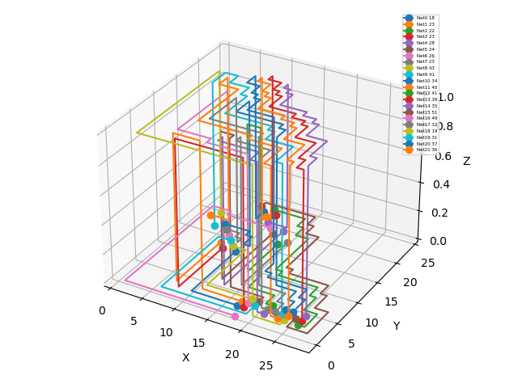

# routing-lab
NYCU 2023 Spring "The Applications of Algorithms on Routing Problems" Lab Submission

## Lab1: greedy channel router
### Topic
Implement a greedy channel router proposed in [this paper](https://ieeexplore.ieee.org/document/1585533).
### Spec
[Lab1.pdf](lab1/spec/Lab1.pdf)
### Result

## Lab2: global router
### Topic
Implement the global router that can complete [ISPD 2008 Global Routing Contest](https://www.ispd.cc/contests/08/ispd08rc.html), and try to minimize the total overflow (TOF), max overflow (MOF), wirelength (WL) and runtime.
### Spec
[Lab2.pdf](lab2/spec/Lab2.pdf)
### Result
Congestion map (top: horizontal, bottom: vertical):
| adaptec1 | adaptec2 | adaptec3 | adaptec4 | adaptec5 |
| - | - | - | - | - |
|  |  |  |  |  |
|  |  |  |  |  |

All testcases satisfies the requirements in spec!

## Lab3: SAT-based router
### Topic
Implement a grid-based 2-pin net router based on the routing part mentioned in [this paper](https://dl.acm.org/doi/10.1145/3400302.3415612). It is required to use MaxSAT/ILP solver such as [Open-WBO MaxSAT Solver](https://github.com/sat-group/open-wbo) or [glpsol](https://www.gnu.org/software/glpk/).

### Spec
[Lab3.pdf](lab3/spec/Lab3.pdf)

### Result
| [case1.txt](lab3/spec/case/case1.txt) | [case2.txt](lab3/spec/case/case2.txt) | [case3.txt](lab3/spec/case/case3.txt) | [case4.txt](lab3/spec/case/case4.txt) | [case5.txt](lab3/spec/case/case5.txt) |
| - | - | - | - | - |
|  |  |  |  |  |